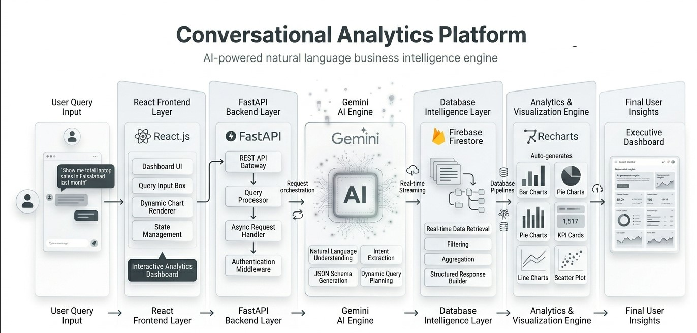

# 📊 Conversational Analytics Platform

An enterprise-grade, full-stack conversational business intelligence engine. This platform abstracts complex database querying layers by converting raw human language (e.g., **"Show me total sales for laptops in Faisalabad last month"**) into structured data models and rendering dynamic, real-time visual charts instantly.

---

## 🔧 Visual System Architecture & Data Flow

**Flow description:**
- The user types a plain-language question into the chat interface
- The UI layer forwards the text along with a system prompt to the AI engine
- The AI engine returns structured JSON filters (product, city, date range, aggregation type)
- The backend server receives those filters and constructs a programmatic database query
- The database returns matching documents back to the backend
- The backend shapes the response and sends it to the dashboard
- The dashboard auto-detects the correct chart type and renders the visual
---

---

## ⚙️ How It Works — End to End

**Step 1 — User input**
The user types a natural language question such as *"Show total sales for laptops in Faisalabad last month"* into the chat panel.
 
**Step 2 — Text forwarded to AI engine**
The UI packages the raw text together with a strict system prompt and sends it to the AI engine for interpretation.
 
**Step 3 — AI parses intent**
The AI engine performs zero-shot parameter mapping. It reads the question and extracts structured fields: `product`, `city`, `date_range`, and `aggregation`. These are returned as a clean JSON object.
 
**Step 4 — Backend receives JSON filters**
The backend server receives the JSON filters via a POST request. It resolves the filters into a programmatic NoSQL query against the database.
 
**Step 5 — Database returns matching records**
The database executes the query using real-time listeners and returns only the documents that match the filter conditions.
 
**Step 6 — Response shaped and returned**
The backend packages the results into a typed response object and sends it back to the UI layer.
 
**Step 7 — Chart auto-rendered**
The UI inspects the response keys to determine the correct chart type and mounts the appropriate visual component — bar chart, line chart, pie chart, scatter plot, KPI card, or data table.
 

---

## 🗂️ Layer Component Responsibilities

**Layer 1 — UI layer**
Captures plain text input from the user. Sends the raw text together with the system prompt to the AI engine. Receives the final response package and triggers chart rendering.
 
**Layer 2 — AI engine**
Performs zero-shot parameter mapping on the incoming natural language. Outputs a strict JSON object containing filter fields such as product name, city, date range, and aggregation type. No manual query building required.
 
**Layer 3 — Backend server**
Receives JSON filters from the UI. Resolves those filters into a dynamic, programmatic query. Executes the query against the database and returns a fully shaped response package to the UI.
 
**Layer 4 — Database**
Stores all business records in a NoSQL document structure. Accepts programmatic filter conditions and returns only matching documents. Supports real-time listeners for live data updates.
 
**Layer 5 — Component mapper**
Inspects the response package keys to determine which chart component to mount. Automatically selects and renders the correct visual: bar, line, pie, scatter, KPI card, or table.
 
---
## 📊 Dynamic Component Mapper

 
When the backend response arrives, the component mapper reads its data keys and routes to the appropriate visual component:
 
| Response key       | Component rendered |
|--------------------|--------------------|
| `sales_data`       | Bar chart          |
| `trend_data`       | Line chart         |
| `category_data`    | Pie chart          |
| `correlation_data` | Scatter plot       |
| `list_query`       | Data table         |
| `aggregate_data`   | KPI cards          |
 
No manual chart selection is needed. The mapping is automatic and driven entirely by the shape of the returned data.
 
---
## 🏗️ Enterprise Tech Stack

| Technology | Role | Details |
|------------|------|---------|
| ⚛️ **React.js** | Frontend UI | Component-driven decoupled state hooks; dynamic SVG rendering |
| ⚡ **FastAPI** | Backend Server | Asynchronous framework deployed via Uvicorn instances |
| 🤖 **Google Gemini Pro** | LLM Engine | Structured via strict system prompts for JSON extraction |
| 🔥 **Firebase Firestore** | NoSQL Database | Real-time data sync with programmatic filtering |
| 📊 **Recharts** | Data Visualization | Bar, Line, Pie, Scatter, KPI cards auto-mounted |
| 🐍 **Python 3.12** | Backend Runtime | Isolated virtual environment; strict zero-shot mapping |
