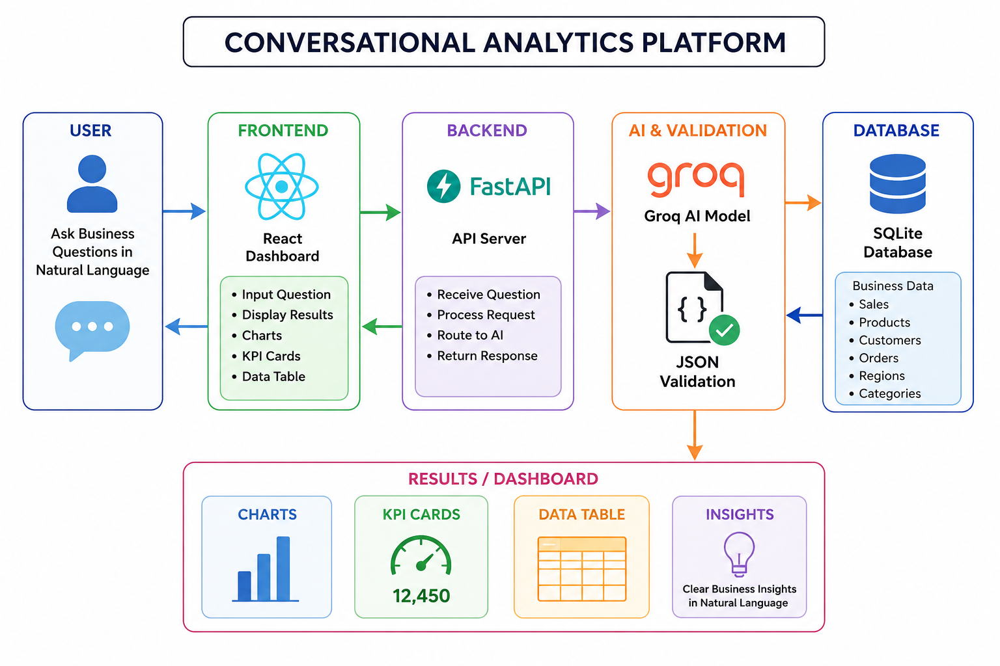
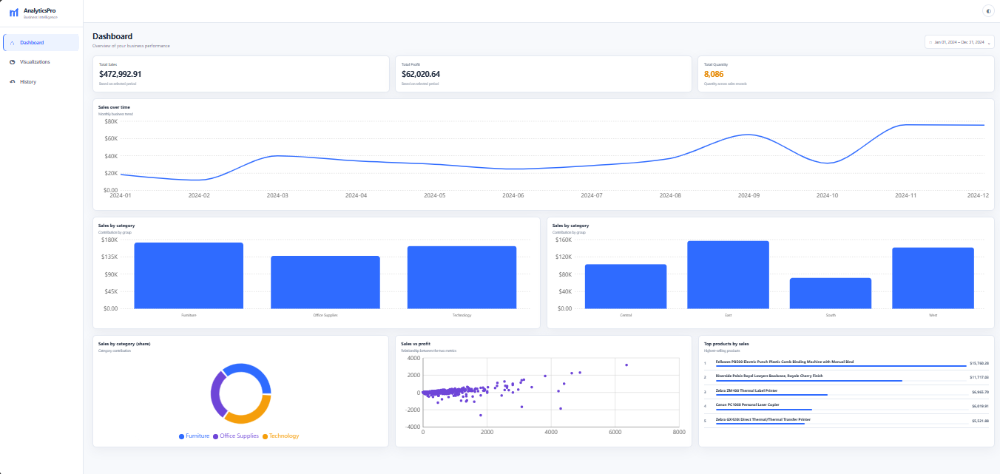
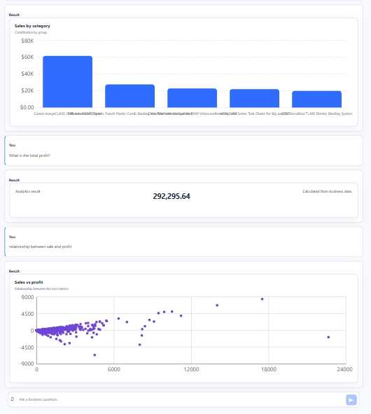

# Conversational Analytics Platform 
## Overview

Conversational Analytics Platform is a business analytics platform that allows users to ask business questions in natural language and receive clear, easy-to-understand analytical results.

Instead of manually searching through business data, users can simply ask questions about sales, profit, products, categories, regions, customers, and trends.

The platform presents the results through simple visualizations such as charts, tables, and key performance indicators.

## Workflow Diagram

## Demo Link

[Live Demo](YOUR_DEMO_LINK_HERE)

## Aim

The aim of the Conversational Analytics Platform is to make business data easier to understand and explore.

It helps users interact with business information through natural language and quickly understand important sales and performance insights.

## Key Features

- Natural-language business questions.
- Sales and profit analysis.
- Sales analysis by category.
- Sales analysis by region.
- Top product analysis.
- Sales trends over time.
- City-based sales analysis.
- Date-range sales analysis.
- Customer order lookup.
- Sales and profit relationship analysis.
- KPI results.
- Interactive charts.
- Tables for detailed results.
  
## Screenshots

### Dashboard

### Analytics Result

## Benefits

- Makes business data easier to understand.
- Allows users to ask questions in natural language.
- Reduces the need for manual data analysis.
- Provides clear visual representations of business information.
- Helps users understand sales and profit performance.
- Makes business insights easier and faster to access.

